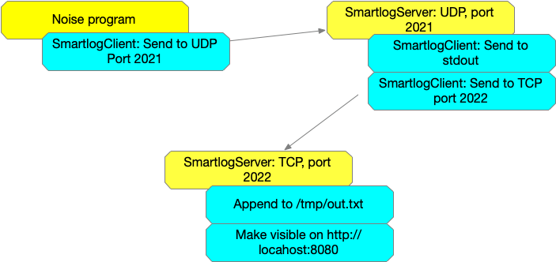

# Smartlog

Smartlog is a yet-another-package for Go to make logging easier. (Well, easier for me, it's the way I like it.) Log statements can be processed locally (to `stdout` or a file), made visible in a webpage, or sent remotely to a server over TCP or UDP for further handling.

***Found a bug, got a question or a request? Open an [issue](https://github.com/KarelKubat/smartlog/issues/new)! I will react as fast as I can, time permitting.***

Smartlog contains all support code to embed such logging into your programs:

- To embed client code into your programs that need to emit log messages,
- To embed server code into a centralized server for further processing,
- ... though there is also a ready-to-use `smartlog-server` that should cover most usecases.

> Smartlog tries to be smart in the following design choices:
>
> - Smartlog understands message types. When messages are generated faster then they can be handled, less important ones are dropped. More important ones are never dropped.
> - Smartlog keeps the client code short and simple. You are encouraged to log to just one log destination to keep the overhead low; you don't want to slow down your program just because you add logging. If you want to fan out to multiple destinations, you're encouraged to forward messages to a smartlog server and to fan out from there.
> - There is no enforced message format (unlike other loggers that enforce key/value pairs and the such). Want to log JSON structures? Sure, serialize and log them. The recipient will have to deal wth deserializing and interpretation. Unstructured? Also good. The client code should be fast & care-free of such aspects.
> - If you log to a file, Smartlog will just append to it and it will detect when the logfile disappears - have an external script manage log saving and rotating. That doesn't need to be part of the program code.

## Concepts

### Emitting messages from your Go program

A program that wishes to provide some logging information uses a smartlog client to emit messages. Smartlog supports several message types:

- Debug messages are emitted when a threshold is exceeded. You can sprinkle calls to `client.Debug(lev, msg)` or `Debugf(lev, format, ...)` with different levels in your program and then set an appropriate threshold to either have these emitted or suppressed.
- Informational messages: `client.Info(msg)` or `Infof(format, ...)`,
- Warnings: `client.Warn(msg)` or `Warnf(format, ...)`,
- Fatal errors: `client.Fatal(msg)` or `Fatalf(format, ...)` which also cause the program to exit.

*Philosphical intermezzo.*

*There's a ton of discussions on what logging should be aimed at, what it should do, and especially what it should not do. Smartlog is neither as pure as the suggestions by [Dave Cheney](https://dave.cheney.net/2015/11/05/lets-talk-about-logging) nor as generic as Go's [log package](https://pkg.go.dev/log). Instead chooses the following approach:*

- *Debug messages can be used during development and should be aimed at programmers. You can leave them in the code; in production they can be turned into no-ops by choosing an appropriate level. Or, if needed, you can turn up the level and see what's going on.*
- *Informational messages are aimed at users in order to provide relevant (business) data, like "your bank balance looks great today".*
- *Warnings are just informational messages that should stand out, like "your bank balance is dangerously low". They don't fix anything; the dangerous situation still needs to be handled by your program.*
- *Fatals should not be used, except in the simplest of programs where it's ok to `exit(1)` and to abandon all running threads, pending file writes, etc.. Programs that need cleanups should just issue a warning, and let the appropriate error bubble up to `main()` for handling.*

Smartlog servers have a queue for incoming messages. When this queue fills up (i.e., messages are received faster than they are handled) then debug messages are discarded first. If the queue still fills up, informational messages are discarded. Received warnings and fatals are never discarded.

### Client types

Client types define how a message should be handled. Smartlog supports the following types:

- File-based clients dump messages into a file by appending to it. The file may disappear while your program is running; in that case, smartlog will simply re-create it.
- A special case is the filename `stdout`, which instructs smartlog to send messages to the *stdout* stream.
- HTTP clients start an HTTP server where messages can be viewed.
- Forwarders (network clients) send messages to a remote server. Smartlog supports UDP and TCP:
  - UDP is faster, but the network transmission is not guaranteed.
  - TCP is slower, but guaranteed.
- There is a client for loadtesting that discards messages (the `none` client).  

All client types except the forwarding clients can be used stand-alone, i.e., just as a part of your program. Forwarders need to connect to a a Smartlog server (in test scenarios `nc` or `netcat` can be used).

### Smartlog servers need smartlog clients too

A Smartlog server (which receives messages over TCP or UDP) is in itself useless. It needs clients to do something with incoming messages. The clients that a server uses are are identical to any client that you'd use in your own program: messages arriving at the server may be sent to a file, to `stdout`, kept for viewing in a browser, or forwarded to next hops (and the story repeats at the smartlog servers that accept those via-hop-messages).

Here is an example that uses ready-to-run programs in the package and involves two smartlog servers:

1. In one terminal run:

   ```sh
   # Terminal #1
   # The first positional argument is the server, others are clients.
   # Instructions to smartlog-server are:
   # - Accept messages on TCP, port 2022. 
   # - Save them to /tmp/out.txt.
   # - Make them viewable on http://localhost:8080.
   # tcp://:2022 means any IP on this machine. The filename /tmp/out.txt leads to three
   # slashes in file:///tmp/out.txt; file:// already needs 2.
   go run main/server/smartlog-server.go tcp://:2022 file:///tmp/out.txt http://localhost:8080
   ```

1. In another terminal run:

   ```sh
   # Terminal #2
   # - Accept messages on UDP, port 2021. 
   # - Fan these out to `stdout` and forward them to the TCP server in above terminal #1.
   # udp://:2021 means any IP in this machine. You could restrict the listener to e.g.
   # udp://localhost:2021 to make it unavailable outside.
   go run main/server/smartlog-server.go udp://:2021 file://stdout tcp://localhost:2022
   ```

1. In a third terminal, run:

   ```sh
   # Terminal #3
   # Use the test client to generate some noise and send it over UDP to port 2021.
   go run main/test/noiseclient/noiseclient.go udp://localhost:2021
   ```

After this, you should:

- See the sent messages in terminal #2 (because of the client `file://stdout`)
- See the same messages in `/tmp/out/txt` (because of the client `file:///tmp/out.txt`)
- See the same messages when you point your browser to `http://localhost:8080`.

The message flow is illustrated in the below figure.



If you want to see it slower, rerun in the third terminal:

   ```sh
   # Terminal #3
   # Flag -d=0.5s waits half a second after emitting a message. You will see the messages flowing
   # into the other terminals.
   # can also run `tail -f /tmp/out.txt` in yet another terminal to see that file grow.
   go run main/testclient/testclient.go -d=0.5s udp://localhost:2021
   ```

## The client code

### Overview of message-generating methods

Method                                  | Remarks
------                                  | -------
`Debug(lev uint8, msg string)`          | Tracing messages, generated when `lev` is below or equal to `client.DebugThreshold`. First type to be dropped when messages can't be dispatched fast enough.
`Debugf(lev uint8, format string, ...)` | `Printf()`-like sibling
`Info(msg string)`                      | Informational messages, should be readable for users. Second type to be dropped.
`Infof(format string, ...)`             | `Printf()`-like sibling
`Warn(msg string)`                      | Warnings that should stand out.
`Warnf(format string, ...)`             | `Printf()`-like sibling
`Fatal(msg string)`                     | Fatal messages. Invocation exits the program. **Use with care** as goroutines are not stopped, buffers are not flushed etc..
`Fatalf(format string, ...)`            | `Printf()`-like sibling

### The default (global) client and non-global clients

Smartlog provides a default (global) client and generic functions `Info()` (or ~`f)`, `Warn()` (or ~`f`) etc. The default client is `client.DefaultClient`.

The following invocations are equivalent:

```go
import (
  "github.com/KarelKubat/smartlog/client"
)
func checkErr(err error) {
  if err != nil {
    ... // do something useful
  }
}
...
checkErr(client.Info("hello world"))               // client.Info() sends to the DefaultClient
checkErr(client.DefaultClient.Info("hello world")) // same thing, explicit
```

The default client sends its output to `stdout`. It can be redefined to emit messages to another destination:

```go
import (
  "github.com/KarelKubat/smartlog/client"
  "github.com/KarelKubat/smartlog/client/any"
)
...
checkErr(client.Info("hello world")) // goes to stdout

var err error
client.DefaultClient, err := any.New("file://program.log")
checkErr(err)
checkErr(client.Info("hello world")) // appends to `program.log`

client.DefaulClient, err = any.New("udp://localhost:2021")
checkErr(err)
checkErr(client.Info("hello world")) // now dispatched over UDP
```

Non-global clients can be similarly constructed. That way your program can instantiate multiple loggers for multiple purposes.

```go
import (
  "github.com/KarelKubat/smartlog/client"
  "github.com/KarelKubat/smartlog/client/any"
)
...
cl, err := any.New("udp://localhost:2021")
checkErr(err)
checkErr(cl.Info("hello world"))
```

### Controlling whether Debug() and Debugf() generate messages

The method `Debug()` (or its sibling ~`f()`) only generates messages when the level which is passed-in the call matches the treshold `client.DebugThreshold`.  The threshold is a non-negative `uint8` which defaults to zero (so you have 256 levels at your disposal). This means that out of the box `Debug(1, msg)`, `Debug(2, msg)` etc. don't produce logging unless `client.DebugThreshold` is modified.

Example:

```go
include (
  "flag"
  "github.com/KarelKubat/smartlog/client"
)

func main() {
  verbosityFlag := flag.Int("verbosity", 0, "verbosity of debug messages")
  flag.Parse()
  client.DebugThreshold = uint8(*verbosityFlag)

  client.Debugf(3, "lorem ipsum")  // suppressed unless -verbosity=3 (or higher) is given
                                   // ... and you might want to check the returned error
}
...
```

### The any client and URIs

The module `smartlog/any` can parse a URI and return a corresponding smartlog client. A URI consists of a scheme (`file`, `udp` etc.), followed by `://`, followed by one or more colon-separated parts.

- `any.New("file://stdout")` returns a client that writes to `stdout`,
- `any.New("file://FILENAME")` returns a client that appends to `FILENAME`,
- `any.New("http://HOSTNAME:PORT")` returns a client that buffers messages that can be viewed by a browser,
- `any.New("udp://HOSTNAME:PORT"`) returns a client that sends messages to a UDP listener,
- `any.New("tcp://HOSTNAME:PORT"`) is simlar, but used TCP for transport.

The loadtesting client that discards messages can be constructed using `any.New("none://WHATEVER")`.

## Server Code

Chances are that you won't need to include code for the smartlog server in your programs. The binary `smartlog-server` is usually sufficient. However, in short:

The server is in the module `"github.com/KarelKubat/smartlog/server"`.  Using it is a has multiple steps:

- Instantiation using `srv, err := server.New(uriString)`
- Adding at least one fanout client using `srv.AddClient(someClient)`
- Starting `srv.Serve()`.
- The server may be shut down using `srv.Close()`.

For an example see the file [`main/server/smartlog-server.go`](https://github.com/KarelKubat/smartlog/blob/master/main/server/smartlog-server.go).

## Tweaks

### Timestamps

Any client-side invocation like `client.Info("hello world")` leads to a message which has the timestamp. Two settings can be controlled:

- The timestamp format: the default is `"2006-01-02 15:04:05 MST"` (see e.g. the [Go time package](https://pkg.go.dev/time) or [Geeks for geeks](https://www.geeksforgeeks.org/time-formatting-in-golang/)).
- Whether the time is displayed relative to localtime. The alternative is relative or to UTC, and he default is `false`: the localtime is shown, not the UTC time.

To change the defaults, simply modify the global variables in the package `"github.com/KarelKubat/smartlog/msg"`:

```go
import (
  "time"
  "github.com/KarelKubat/smartlog/client"
  "github.com/KarelKubat/smartlog/msg"
)    
// ...
msg.DefaultTimeFormat = time.RFC3339 // format: "2006-01-02T15:04:05Z07:00"
msg.UTCTime = true                   // show the UTC time, not the localtime
client.Info("hello world")           // uses the new format and shows UTC
```

The default timestamp format `msg.DefaultTimeFormat` applies to all clients that don't set their own preference (this includes the global client). That means that, if needed, you can set different formats for different clients:

```go
// See also main/test/clienttimestamps/clienttimestamps.go
import (
  "time"
  "github.com/KarelKubat/smartlog/client/any"
)
... 
cl1, err := any.New("file://file1.log")
checkErr(err)

cl2, err := any.New("file://file2.log")
checkErr(err)
cl2.TimeFormat = time.RFC3339

cl1.Info("hello world from client #1")  // 2021-12-05 12:31:00 CET | I | hello from client #1
cl2.Info("hello world from client #2")  // 2021-12-05T12:31:00+01:00 | I | hello from client #2
```

### Stored messages in HTTP clients

HTTP clients store a limited number of messages. The oldest ones are discarded when new messages arrive and the limit is reached. The limit value is the variable `KeepMessages` in the package "github.com/KarelKubat/smartlog/client/http". To change this value:

```go
import (
  "github.com/KarelKubat/smartlog/client/http"
)
...
http.KeepMessages = 10000 // store a lot of messages
```

It should be noted that if you need to do this, then maybe you should not log just to an HTTP client, but in parallel also to a different kind - maybe a file client that's not limited by resources (other than diskspace, which is cheap). This can be achieved by:

- Instantiating a forwarding client over TCP or UDP,
- Having a Smartlog server accept these messages,
- Configuring it to fan out the messages to both an HTTP and a file client.

You can even start a server inside your program just for the purpose of fanning out. See [`main/test/load/load.go`](https://github.com/KarelKubat/smartlog/blob/master/main/test/load/load.go) for an example.

### Finding dropped network links

When networked clients detect a problem while trying to send a message to a smartlog server, they will try to re-establish the connection. Reconnecting is a back-off process:

- It's retried `client.RestartAttempts` times
- Between each retry there is an increased waiting period, which is `client.RestartWait` during the first retry, twice as long during the second retry, three times as long during the third, and so on.
- When all attempts are exhausted, then:
  - Reconnecting fails,
  - Sending the message fails, and
  - `client.Info()` or whichever function was invoked returns an error.

The actual numbers can be found in `client/client.go`. If you need to adjust them:

```go
import (
  "time"
  "github.com/KarelKubat/smartlog/client"
)
...
client.RestartAttempts = 5                // try 5 times
client.RestartWait     = time.Second / 2  // wait 0.5sec and retry, then 1.0sec and retry, 
                                          // then 1.5sec, then 2.0sec etc.
```

The obvious advantage is that this procedure heals temporary network or server hiccups. The disadvantage is that a permanent unfixable error is detected much later. In the above example it's 0.5s + 1.0s + 1.5s + 2.0s + 2.5s, which is a long time.

> NOTE: A similar mechanism is used by the smartlog server to establish listeners. Upon failed reads it tries to start a new one, `server.RestartAttempts` times, with a wait time of `server.RestartWait` during the first retry, twice as much during the second retry, etc.. You can adjust these values when constructing smartlog a server.
